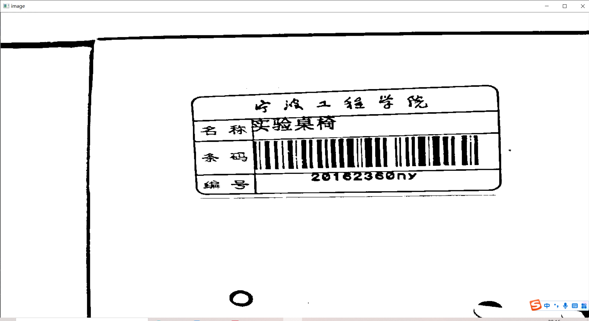
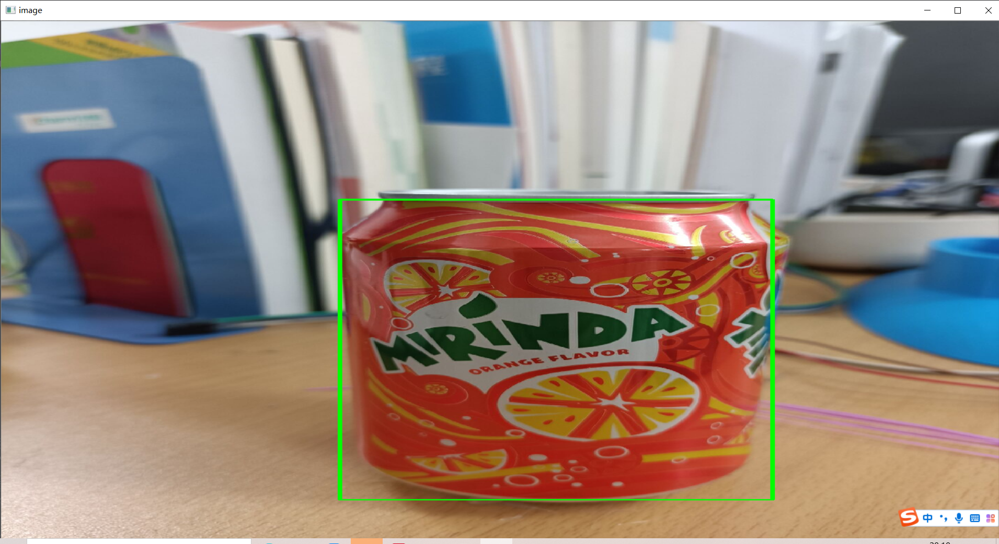

任务1

```python
img = cv2.imread('d:/python/works/pictures/label.jpg')
gray=cv2.cvtColor(img,cv2.COLOR_BGR2GRAY)#转化为灰度图
# ret,binary = cv2.threshold(gray, 130, 255, cv2.THRESH_BINARY)
binary = cv2.adaptiveThreshold(gray, 255, cv2.ADAPTIVE_THRESH_GAUSSIAN_C, cv2.THRESH_BINARY, 101, 20)#二值化
```

读取图片转化为灰度图再进行二值化



任务2

```python
hsv = cv2.cvtColor(img, cv2.COLOR_BGR2HSV)
lower = np.array([0, 100, 0])
upper = np.array([10, 255, 255])
mask = cv2.inRange(hsv, lower, upper)
res = cv2.bitwise_and(img, img, mask=mask)  # 对原图与掩膜进行位运算
gray = cv2.cvtColor(res, cv2.COLOR_BGR2GRAY)
ret, thresh = cv2.threshold(gray, 0, 255, cv2.THRESH_BINARY)  # 二值化
contours, hierarchy = cv2.findContours(thresh, cv2.RETR_EXTERNAL, cv2.CHAIN_APPROX_NONE)  # 找出所有轮廓
```

用掩膜方式减少识别干扰

```python
# 找出最大轮廓
area = []  # 定义一个空列表
for k in range(len(contours)):
    area.append(cv2.contourArea(contours[k]))  # 向列表里添加每一个轮廓的面积
max = np.argmax(np.array(area))  # 找到列表中面积最大的元素
cnt = contours[max]
```

找到最大的一个轮廓

```python
# # 用矩形识别
# x, y, w, h = cv2.boundingRect(cnt)
# center=(int(x+w/2),int(y+h/2))#计算中心点
# print('长', w, '宽', h,'中心点',center)
# img = cv2.rectangle(img, (x, y), (x + w, y + h), (0, 255, 0), 5)

# 用圆识别
(x, y), radius = cv2.minEnclosingCircle(cnt)
center = (int(x), int(y))
radius = int(radius)
print('中心点', center, '半径', radius)
img = cv2.circle(img, center, radius, (0, 255, 0), 5)
```

两种识别方法并输出各自的中心点，矩形的长宽、圆形的半径

```python
leftmost = tuple(cnt[cnt[:, :, 0].argmin()][0])
rightmost = tuple(cnt[cnt[:, :, 0].argmax()][0])
topmost = tuple(cnt[cnt[:, :, 1].argmin()][0])
bottommost = tuple(cnt[cnt[:, :, 1].argmax()][0])
print('左极点', leftmost, '右极点', rightmost, '上极点', topmost, '下极点', bottommost)
```

得到四个极点

